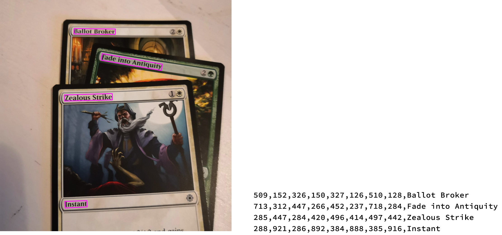
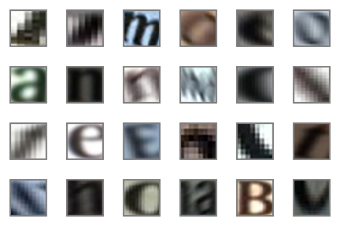
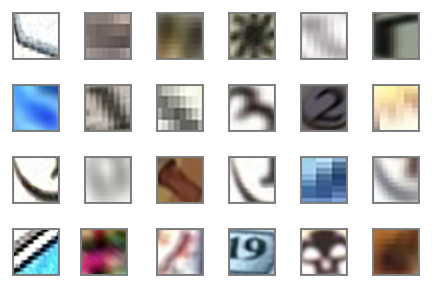
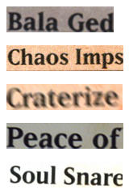
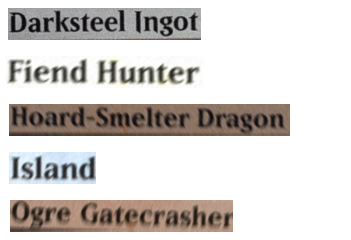

# visions-datasets
Datasets for training machine learning models to read MTG card names in images.

## Validation dataset
<em>Validation image with visualized target detections and related annotations</em>

This dataset located in ``validation`` folder was used to validate the method used in [Visions](https://github.com/LauriHursti/visions). The method achieves 0.96 recall and 0.993 precision in recognizing cards using this dataset.

The inputs consist of images that have multiple MTG cards in them. Those can be found in ``validation/images``. There's 500 images containing 1750 cards in total including 875 modern frame cards and 875 M15 frame cards.

In addition to the images there's the ground truth annotations containing target detections and card names in [ICDAR 2015 format](https://rrc.cvc.uab.es/?ch=4&com=tasks). Those can be found in ``validation/gt``. Gt and image files can be paired by name. E.g. image ``IMG_20191130151746.jpg`` has a gt file called ``gt_IMG_20191130151746.txt``. 

While files in ``validation/gt`` contain target detections for full card names, there's also target detections for single words. Those are in ``validation/gt_split``. Many text detection algorithms detect singular words, so this dataset is useful for them.

In addition to card names the card type can be included if it's fully visible.

## Connected components of text and noise

<em>Name text connected components</em>

<em>Other connected components</em>

[FASText algorithm](https://www.cv-foundation.org/openaccess/content_iccv_2015/papers/Busta_FASText_Efficient_Unconstrained_ICCV_2015_paper.pdf) searches images for connected components that could be parts of text. The found components have to be classified as being parts of text or something else. 

In Visions the classification is done by a convolutional neural network. It was trained with a collection of images of connected components. Components were mined from synthetically created images similar to the images in the validation dataset.

The connected components images are color images of size 24x24. There's 347 783 positive connected components that are parts names and 267 875 negative connected components that are not parts names. Samples of both classes can be found in ``samples/cc_negative`` and ``samples/cc_positive``. There's quite a few files in the dataset so the dataset is split in packages.

[**Folder link**](https://drive.google.com/drive/folders/1gomEEv3TMrWxksDZ2kIz-5_1fwnWAgNi?usp=sharing)

**Positive connected components**

[cc_positive_pkg1.zip](https://drive.google.com/file/d/18yw9tQ1muCPjp0DlMpvlpSLmn2oFvj7X/view?usp=sharing)

[cc_positive_pkg2.zip](https://drive.google.com/file/d/173LJEFjIfGI6LW-6y9kJJGUH1f-e6KiA/view?usp=sharing)

[cc_positive_pkg3.zip](https://drive.google.com/file/d/1Q3N8T-y9p0yqMliqe0EEs5TK8TF3a8s7/view?usp=sharing)

[cc_positive_pkg4.zip](https://drive.google.com/file/d/1Jvf173R3ooGsMN2fWJzljLdOtPl-2ll4/view?usp=sharing)

[cc_positive_pkg5.zip](https://drive.google.com/file/d/1z2YBWJT_LsQEGp_qlWkW878Rbf0s1erM/view?usp=sharing)

**Negative connected components**

[cc_negative_pkg1.zip](https://drive.google.com/file/d/1QA5vEhv98ffqa5ziIbEICLPzbjy9xFIn/view?usp=sharing)

[cc_negative_pkg2.zip](https://drive.google.com/file/d/1P9OIBteN9jRk_tJVyaLU006owkc7ct2P/view?usp=sharing)

[cc_negative_pkg3.zip](https://drive.google.com/file/d/1nt1ofiRA6XnLjVDP_k96sVxuzWdkO7RW/view?usp=sharing)

[cc_negative_pkg4.zip](https://drive.google.com/file/d/1MjScac8yg3MthFW-JHMjh4Ph71wY3o7R/view?usp=sharing)

[cc_negative_pkg4.zip](https://drive.google.com/file/d/1X05RUx6TTAkCA6cOPOleJbZjkOZ_R9SO/view?usp=sharing)

## Images of card names

<em>Short names</em>

<em>Long names</em>

Images of card names were used to train the text recognition network. The images are color images with height 32 and varying width. The ground truth is included in the file name e.g. ``Black_Lotus_1.jpg``. The number at the end of the file name separates variations of the same name from each other.

The dataset is split in three parts with different maximum lengths for the content. The first set has starts of names that have maximum 10 characters. The other two are similar datasets for 20 and 44 characters. There's 25 685 images in the 10 character set, 85 380 in the 20 character set and 88 365 in the 44 character set.

Samples from each set can be seen in ``samples/names_10``, ``samples/names_20`` and ``samples/names_44``.

[**Folder link**](https://drive.google.com/drive/folders/1gomEEv3TMrWxksDZ2kIz-5_1fwnWAgNi?usp=sharing)

**10 characters**

[names_10.zip](https://drive.google.com/file/d/18r0z4dBZl6xP9pqlnj27TcyjbDQYoqqE/view?usp=sharing)

**20 charactesr**

[names_20_pkg1.zip](https://drive.google.com/file/d/1Z_UH0jH0qI2j-7dZml0rqeig85_w4uiG/view?usp=sharing)

[names_20_pkg2.zip](https://drive.google.com/file/d/1EgJU2EBy6xdHO9FBbO3yq6XlveyCQJqd/view?usp=sharing)

[names_20_pkg3.zip](https://drive.google.com/file/d/1bFKm-HNSYwyBONRNlpBLJO82hhXYwsW3/view?usp=sharing)

[names_20_pkg4.zip](https://drive.google.com/file/d/1d4-RINLJofJyoo4QCdXOcfvPW1vvVrZX/view?usp=sharing)

**44 characters**

[names_44_pkg1.zip](https://drive.google.com/file/d/1MK7ClOMChocljWvLepG1lJknpRf_Wrff/view?usp=sharing)

[names_44_pkg2.zip](https://drive.google.com/file/d/1TY3y1RG3Pigm3pOAxarqeUYbNyuEsJiD/view?usp=sharing)

[names_44_pkg3.zip](https://drive.google.com/file/d/1IBQ_StbGkb10IvF1TyI2NkmVlKillok3/view?usp=sharing)

[names_44_pkg4.zip](https://drive.google.com/file/d/1pAKNyEDluK7dJ07b4BhM1Q2ovXuQWaLy/view?usp=sharing)

